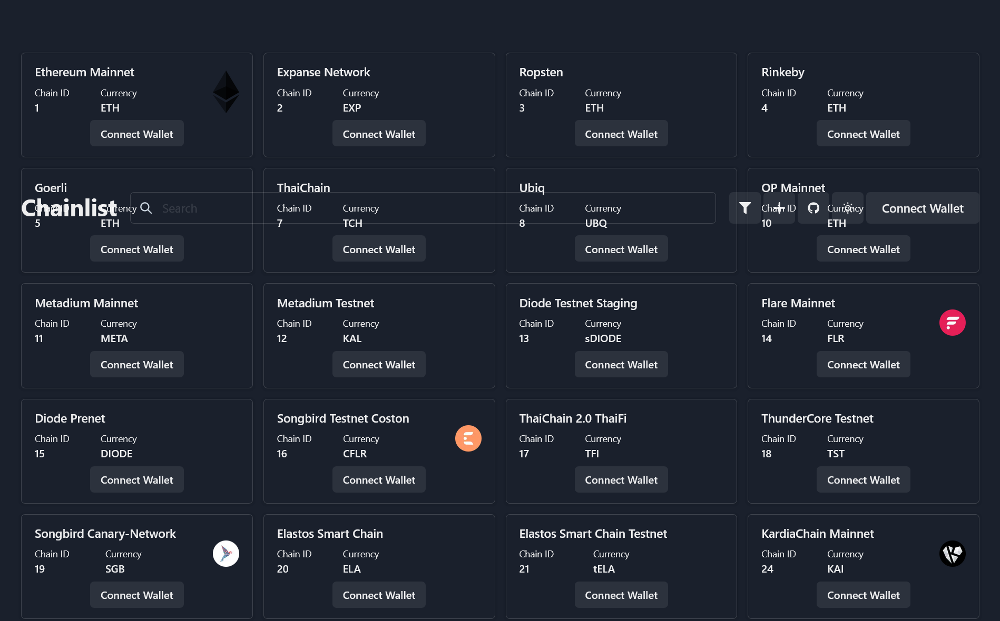

# EVM Chainlist
* Add EVM-based chains to your wallet @ the click of a button , an alternative to chainlink.
* Sister repo to : Blockchain-toolkit @ https://github.com/Mulc1b3R/blockchain-toolkit
* eth-tokens folder contains 1249 top etherium tokens with logo's and hypertext links to it's corresponding smart contract.
*************************************************************************************************************

*************************************************************************************************************

## Getting Started

### Development

Run : ```yarn install```
then : ```yarn run start```
to start the server on : `localhost:8000`.

### Production
Edit files to suit , then , 
To build a static version of the site for production, run the following command
```yarn run build```

## Contributions
FrederikBolding , Mulciber , Chainlist .

## License
This project is [MIT licensed](./LICENSE).
